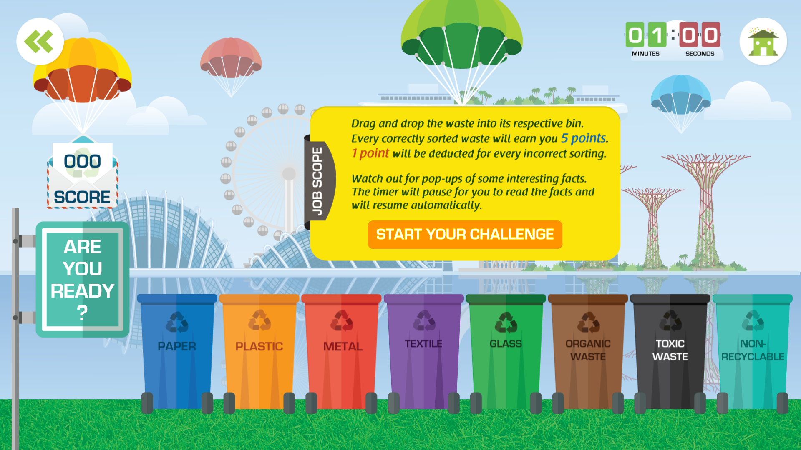

# ♻️ Recycling Drag-and-Drop Game

An interactive educational web game that teaches users how to properly sort different types of waste into the correct recycling bins. Great for students, schools, or anyone looking to brush up on their recycling knowledge through a fun, visual drag-and-drop experience.

- **Project description:** [schoolapp.sg/project/marsiling-secondary-school-environmental-hub/](https://schoolapp.sg/project/marsiling-secondary-school-environmental-hub/)
- **YouTube Video**: [https://youtu.be/PrI6DieHKVY](https://youtu.be/PrI6DieHKVY)
    
 <!-- Replace with actual path or GitHub-hosted URL -->

## 🎮 How to Play
- **Open Game Link**: [https://demo.schoolapp.sg/recycling](https://demo.schoolapp.sg/recycling)
- **Objective**: Drag each falling item of waste into the correct recycling bin before time runs out.
- **Scoring**:
  - ✅ Correct bin: +5 points
  - ❌ Incorrect bin: –1 point
- Interesting environmental facts will occasionally pop up—don't worry, the timer will pause while you read.

## 🗑️ Waste Categories

The game includes the following recycling bins:

- 📄 **Paper**
- 🧴 **Plastic**
- 🥫 **Metal**
- 👕 **Textile**
- 🍾 **Glass**
- 🍌 **Organic Waste**
- ☣️ **Toxic Waste**
- 🚯 **Non-Recyclable**

## ⏱️ Time Limit

- You have **1 minute** to sort as many items as possible.

## 📦 Built With

- HTML5
- CSS3
- JavaScript (Vanilla)
- jQuery UI
- Mottie virtual keyboard
- Responsive design for modern browsers

## 🚀 Getting Started

Clone the repository and open `index.html` in your browser:

```bash
git clone https://github.com/kennykee/recycling-drag-and-drop-game.git
cd recycling-drag-and-drop-game
open index.html   # or use your preferred method to open it in a browser
```
## License

This project is licensed under the MIT License.  
See the [`LICENSE`](./LICENSE) file for full details.
